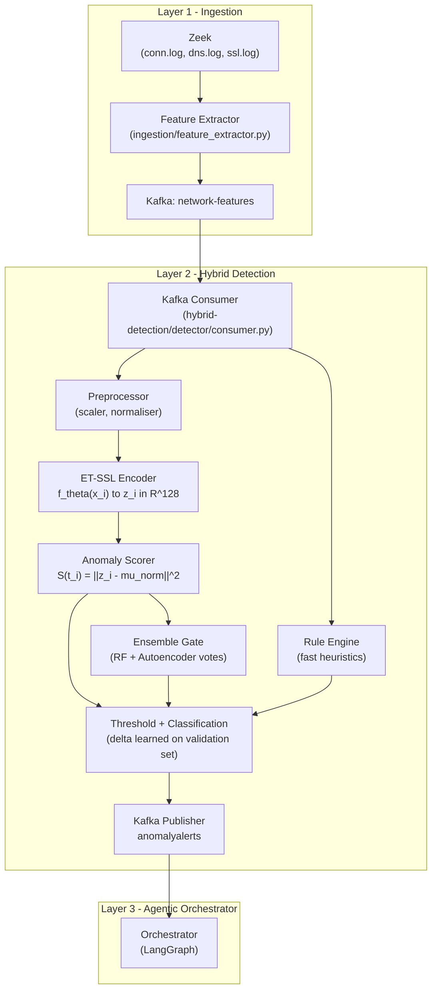
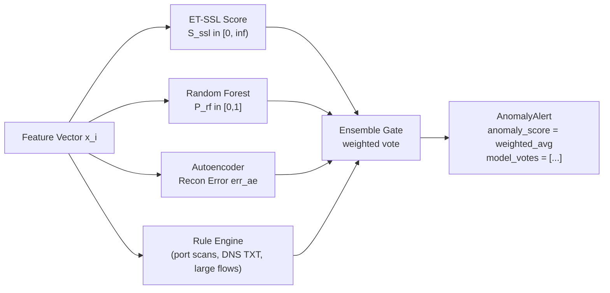
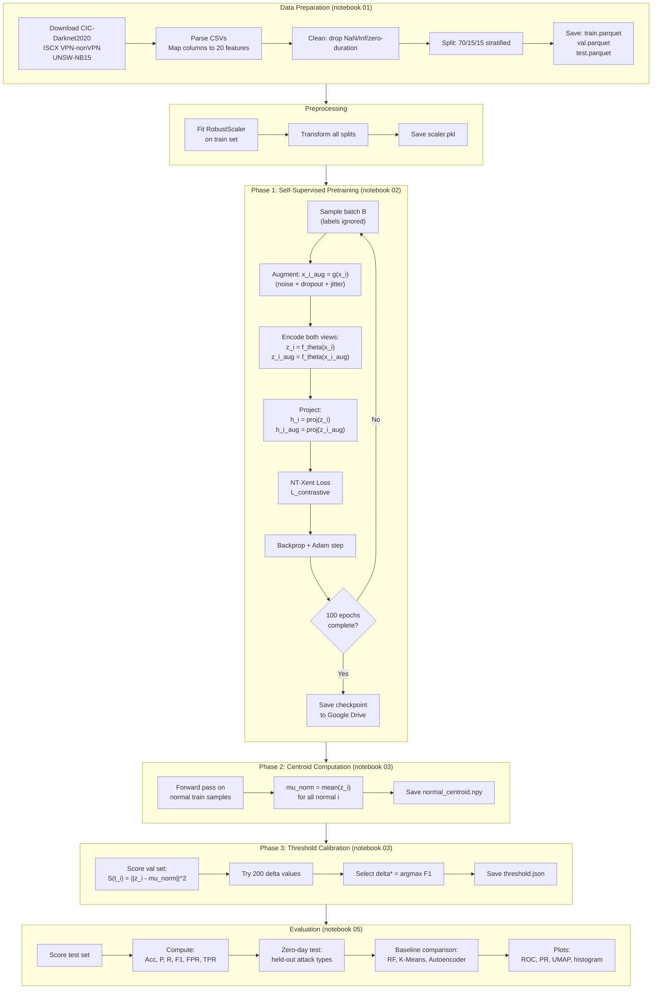
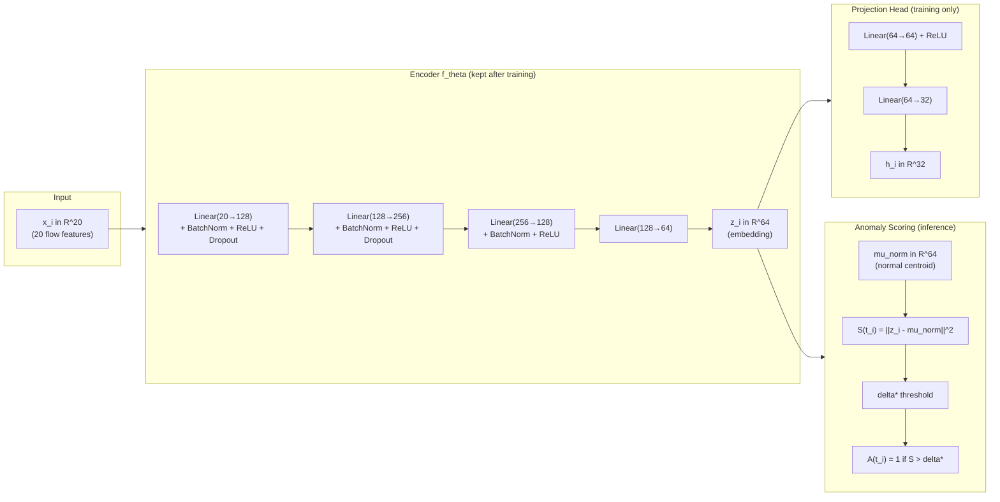
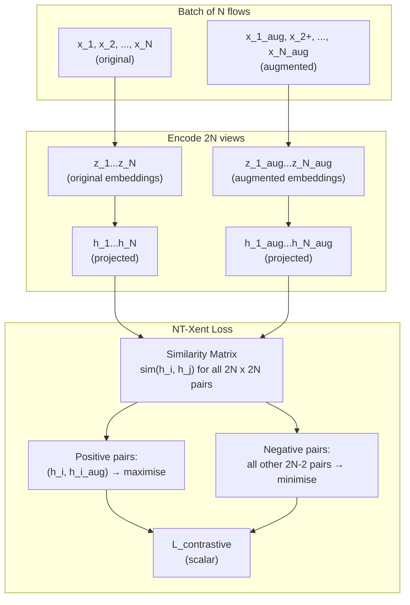
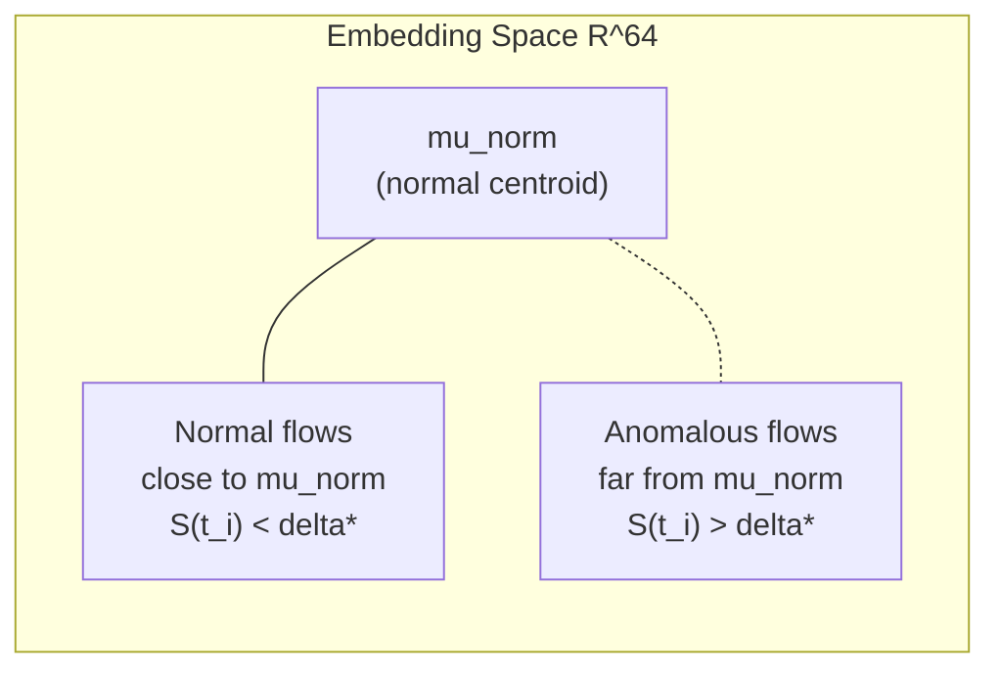
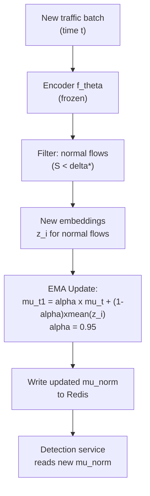
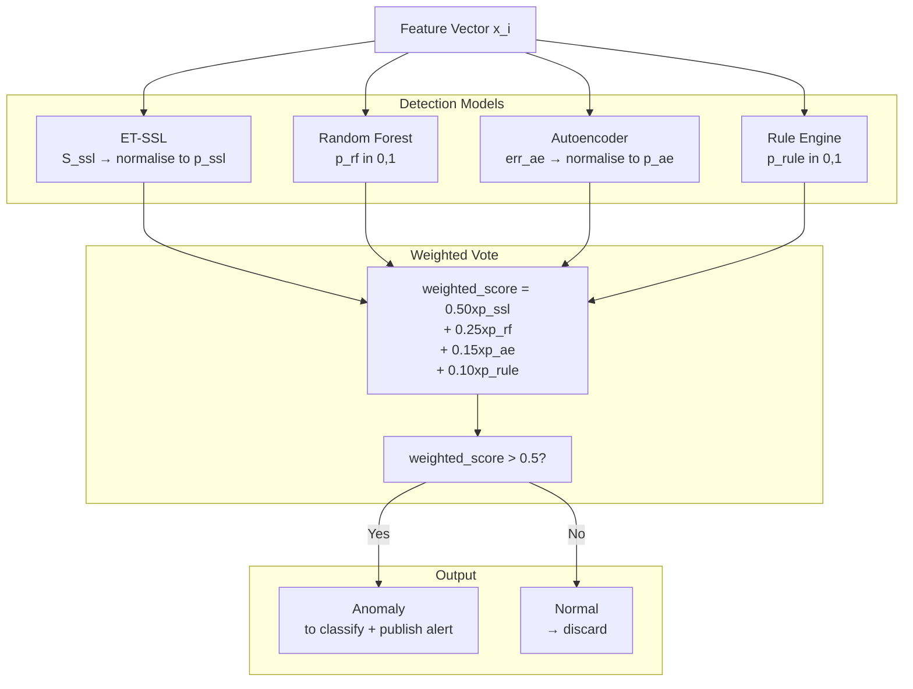
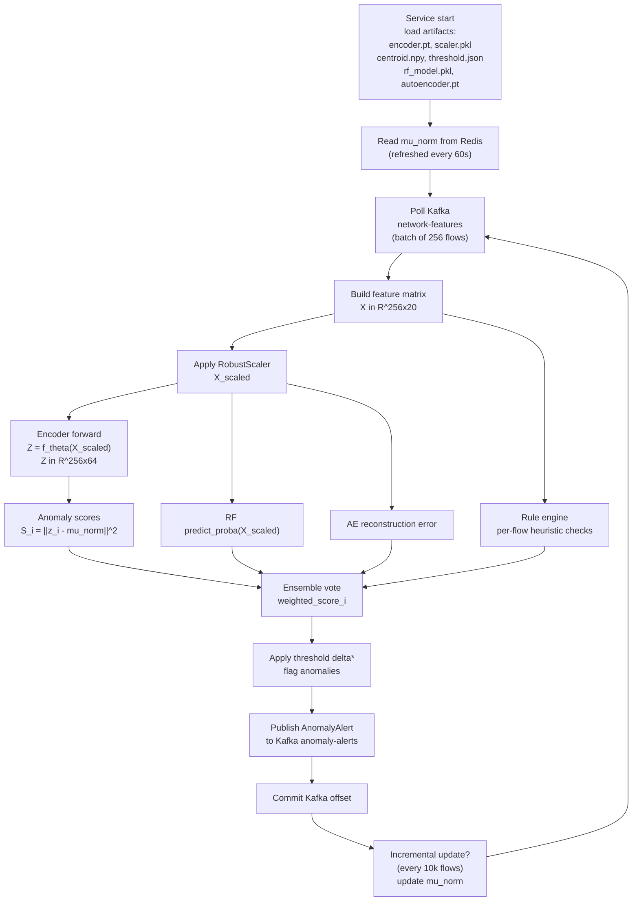

# Sentinel — Hybrid Detection Layer (Layer 2)
### Implementation Guide: ET-SSL Approach

> Based on: *"Anomaly Detection in Encrypted Network Traffic using Self-Supervised Learning"*
> Sattar et al., Scientific Reports (2025). DOI: 10.1038/s41598-025-08568-0

---

## 1. What You Are Building

Layer 2 of Sentinel is the **Hybrid Detection Layer**. It sits between the raw packet ingestion pipeline (Zeek) and the agentic orchestrator (Layer 3). Its job is to:

1. Consume flow-level feature vectors from the Kafka `network-features` topic
2. Run each flow through a trained **ET-SSL** encoder to produce an anomaly score
3. Apply a **hybrid detection strategy**: combine the self-supervised anomaly score with a set of fast rule-based checks and an optional ensemble of classical models
4. Publish `AnomalyAlert` messages to the `anomaly-alerts` Kafka topic for Layer 3 to act on

The paper's ET-SSL framework is adapted into three cooperating components:

| Component | What it does | Where |
|---|---|---|
| **Feature Extractor** | Reads Zeek conn.log (via Kafka), builds the 20-feature input vector | `hybrid-detection/feature_extractor/` |
| **ET-SSL Model** | PyTorch contrastive encoder, trained on CIC-Darknet2020 + UNSW-NB15 + ISCX | `hybrid-detection/model/` |
| **Detection Service** | Loads the trained model, scores live flows, publishes alerts | `hybrid-detection/detector/` |

---

## 2. Architecture Overview



---

## 3. Input Feature Vector

The paper defines the raw feature space as: packet sizes, inter-arrival times, flow duration, packet count, and protocol metadata. For your Zeek-based pipeline, these map to the following **20 features**:

### 3.1 Feature Table

| # | Feature Name | Zeek Field | Type | Description |
|---|---|---|---|---|
| 1 | `duration` | `duration` | float | Total flow duration in seconds |
| 2 | `orig_bytes` | `orig_bytes` | int | Bytes sent by originator |
| 3 | `resp_bytes` | `resp_bytes` | int | Bytes sent by responder |
| 4 | `orig_pkts` | `orig_pkts` | int | Packets sent by originator |
| 5 | `resp_pkts` | `resp_pkts` | int | Packets sent by responder |
| 6 | `bytes_ratio` | `orig_bytes / (resp_bytes + 1)` | float | Asymmetry of flow (PL feature) |
| 7 | `pkt_rate` | `orig_pkts / (duration + 1e-6)` | float | Packets per second (PC feature) |
| 8 | `mean_pkt_size` | `orig_bytes / (orig_pkts + 1)` | float | Mean packet size originator |
| 9 | `mean_resp_pkt_size` | `resp_bytes / (resp_pkts + 1)` | float | Mean packet size responder |
| 10 | `log_duration` | `log1p(duration)` | float | Log-transformed duration |
| 11 | `log_orig_bytes` | `log1p(orig_bytes)` | float | Log bytes (handles skew) |
| 12 | `log_resp_bytes` | `log1p(resp_bytes)` | float | Log bytes (handles skew) |
| 13 | `conn_state` | one-hot (SF, S0, REJ, RSTO, RSTR, OTH) | int×6 | Connection state flags (PM feature) |
| 14 | `proto_tcp` | `proto == "tcp"` | int | TCP flag |
| 15 | `proto_udp` | `proto == "udp"` | int | UDP flag |
| 16 | `is_dns` | `dst_port == 53` | int | DNS flag |
| 17 | `is_ssl` | `service == "ssl"` | int | TLS/SSL flag |
| 18 | `dst_port_norm` | `dst_port / 65535` | float | Normalised destination port |
| 19 | `service_http` | `service == "http"` | int | HTTP service flag |
| 20 | `service_unknown` | `service == "-"` | int | Unknown/encrypted service |

> **Why these 20?** The paper specifies PL (packet length distribution), IPI (inter-packet time), FD (flow duration), PC (packet count), and PM (protocol metadata). Since Zeek does not export raw per-packet timings, IPI is approximated by `pkt_rate` and `duration`. The log transforms handle the heavy-tailed distributions typical in network traffic. The connection state one-hot encoding captures the PM (protocol metadata) signal the paper uses.

### 3.2 Feature Vector Construction

Write `feature_extractor/feature_builder.py`:
- A `build_feature_vector(conn_record: dict) -> np.ndarray` function
- Input: a single parsed Zeek conn.log record (JSON dict from Kafka)
- Output: a 1D NumPy array of shape `(20,)` with dtype `float32`
- Handle missing fields with sensible defaults (0 for bytes/packets, -1 for unknown state)
- Apply `np.clip` on outlier-prone fields before logging

---

## 4. Datasets

Train and evaluate on all three datasets the paper uses:

| Dataset | URL (Kaggle) | Size | What it contributes |
|---|---|---|---|
| **CIC-Darknet2020** | `kaggle.com/datasets/dhoogla/cicdarknet2020` | ~10M flows | Botnet, phishing, DDoS in encrypted traffic. Primary training set. |
| **UNSW-NB15** | `kaggle.com/datasets/dhoogla/unswnb15` | ~2.5M flows | Mixed normal + 9 attack types. Diverse feature set. |
| **ISCX VPN-nonVPN** | `ll.mit.edu/r-d/datasets/vpnnonvpn-network-application-traffic-dataset-vnat` | ~250K flows | VPN and non-VPN encrypted flows. Tests encryption generalisation. |

### 4.1 Dataset Handling Strategy

Write `notebooks/01_data_preparation.ipynb` (runs on Colab) with these steps:

1. **Download** — use `kaggle` CLI with your API key; for ISCX use direct download
2. **Parse** — CIC-Darknet2020 and UNSW-NB15 ship as CSVs; load with `pandas`
3. **Column mapping** — each dataset has different column names; write a `COLUMN_MAP` dict to unify them to your 20-feature names
4. **Label extraction** — extract binary label (`0=normal, 1=anomaly`); keep multi-class label for evaluation only
5. **Clean** — drop rows with `NaN`, `Inf`, or `duration == 0`; deduplicate
6. **Class balance check** — log the normal/anomaly ratio per dataset
7. **Train/val/test split** — 70% / 15% / 15% stratified by label (paper's exact splits)
8. **Save** — write `train.parquet`, `val.parquet`, `test.parquet` per dataset

### 4.2 Column Mapping (CIC-Darknet2020 example)

Write a `config/column_maps.py` module with a dict like:
```
DARKNET_MAP = {
    "Flow Duration":     "duration",
    "Total Fwd Packets": "orig_pkts",
    "Total Bwd Packets": "resp_pkts",
    "Total Length of Fwd Packets": "orig_bytes",
    "Total Length of Bwd Packets": "resp_bytes",
    "Flow Packets/s":    "pkt_rate",
    "Label":             "label",
    ...
}
```

For UNSW-NB15 the key columns are: `dur`, `sbytes`, `dbytes`, `spkts`, `dpkts`, `state`, `proto`, `service`, `label`.

---

## 5. Preprocessing Pipeline

Write `model/preprocessor.py` containing:

### 5.1 Normalisation

The paper applies **feature scaling** to prevent large-magnitude features from dominating.
Use **RobustScaler** (not StandardScaler) because network traffic features have heavy tails and outliers.
- Fit the scaler on the **training set only**
- Transform train, val, test with the fitted scaler
- Save the fitted scaler as `artifacts/scaler.pkl` using `joblib`

### 5.2 Augmentation

The paper uses stochastic augmentation to generate self-supervised positive pairs. Write a `Augmenter` class with these transforms:
- **Gaussian noise** — add `N(0, 0.05)` noise to continuous features
- **Feature dropout** — zero out a random subset of up to 3 features (simulates missing fields)
- **Scale jitter** — multiply continuous features by `U(0.9, 1.1)` uniform noise
- **Combinations** — randomly select 1 or 2 augmentations per sample

The `Augmenter` takes a feature vector and returns `(x_original, x_augmented)` — this is the **positive pair** for contrastive learning.

---

## 6. ET-SSL Model Architecture

Write `model/et_ssl.py` in PyTorch.

### 6.1 Encoder Network `f_θ`

A feed-forward encoder with the following architecture:

```
Input: x_i ∈ ℝ^20
  → Linear(20, 128) + BatchNorm1d(128) + ReLU
  → Dropout(0.3)
  → Linear(128, 256) + BatchNorm1d(256) + ReLU
  → Dropout(0.3)
  → Linear(256, 128) + BatchNorm1d(128) + ReLU
  → Linear(128, 64)   ← embedding z_i ∈ ℝ^64
```

The output is the **embedding space** `z_i`. The paper uses `k << d` (embedding dimension << input dimension), so 64-dim embeddings for 20-dim input satisfies this.

### 6.2 Projection Head (for training only)

Following SimCLR practice, attach a small MLP head used only during contrastive training:

```
z_i → Linear(64, 64) + ReLU → Linear(64, 32)  ← projection h_i ∈ ℝ^32
```

The projection head is discarded after training. Anomaly scoring uses `z_i` directly.

### 6.3 Contrastive Loss (NT-Xent / SimCLR)

The paper's loss (Equation 1) is the **NT-Xent** (Normalised Temperature-scaled Cross-Entropy):

For a batch of N flows, generate 2N projections (original + augmented):

```
L_contrastive = (-1/N) × Σ_i log[
    exp(sim(h_i, h_i+) / τ)
    / Σ_{k≠i} exp(sim(h_i, h_k) / τ)
]
```

Where `sim(a, b) = dot(a, b) / (||a|| × ||b||)` is cosine similarity, and `τ` is the temperature parameter (paper uses cross-validation; start with `τ = 0.1`).

Implement as `class NTXentLoss(nn.Module)` using vectorised matrix operations (cosine similarity matrix for the full batch in one pass).

### 6.4 Anomaly Detection Loss

Supplement the contrastive loss with the anomaly separation loss from the paper (Equation 2):

```
L_anomaly = Σ_i I(A(t_i)) × ||z_i − z_0||²
```

Where `z_0` is the centroid of normal embeddings, computed as `mean(z_i for i in normal_samples)`. `I(A(t_i))` is 1 if the sample is anomalous, 0 otherwise.

This loss only applies when training on the **labelled fine-tuning split** (see Section 8).

### 6.5 Total Loss

```
L_total = L_contrastive + γ × L_anomaly
```

Where `γ = 0.5` initially, tuned on the validation set.

---

## 7. Training Procedure (Colab Notebook)

Write `notebooks/02_pretrain_etssl.ipynb`:

### 7.1 Phase 1 — Self-Supervised Pretraining (Unlabelled)

- Use **all flows** (normal + anomalous, labels ignored) from the training split
- For each batch: augment to get `(x_i, x_i+)` pairs → encode both → compute NT-Xent loss
- **No labels used in this phase** — this is the self-supervised part
- Batch size: **256** (paper's value)
- Optimizer: **Adam** with lr=0.001
- LR schedule: decay by 0.95 every 10 epochs
- Epochs: **100**
- Save checkpoint every 10 epochs to Google Drive

### 7.2 Phase 2 — Centroid Computation

After pretraining, run a single forward pass over the **normal training samples** only:
- Collect all `z_i` for normal flows
- Compute `μ_norm = mean(z_i)`
- Save `μ_norm` as `artifacts/normal_centroid.npy`

### 7.3 Phase 3 — Threshold Calibration

On the **validation set**:
- Compute anomaly score `S(t_i) = ||z_i − μ_norm||²` for every sample
- Find the optimal threshold `δ` using the **F1-optimal threshold search**:
  - Try 200 evenly spaced threshold values between `S_min` and `S_max`
  - For each `δ`: classify all val samples, compute F1
  - Select `δ*` that maximises validation F1
- Save `δ*` as `artifacts/threshold.json`

### 7.4 Phase 4 — Fine-Tuning (Optional, with Labels)

If labelled fine-tuning data is available (from CIC-Darknet2020 labels):
- Freeze the first two encoder layers
- Add `L_anomaly` to the loss alongside `L_contrastive`
- Fine-tune for 20 epochs with lr=0.0001
- Re-run centroid computation and threshold calibration

### 7.5 Hyperparameters to Track (log to W&B or Colab output)

| Hyperparameter | Search range | Paper value |
|---|---|---|
| τ (temperature) | 0.05, 0.1, 0.2, 0.5 | not specified — use 0.1 |
| γ (anomaly weight) | 0.1, 0.5, 1.0 | γ balancing factor |
| Embedding dim k | 32, 64, 128 | k << d |
| Batch size | 128, 256, 512 | 256 |
| LR | 1e-4, 1e-3, 1e-2 | 0.001 |
| LR decay | 0.90, 0.95, 0.99 every N epochs | 0.95 per 10 epochs |
| Dropout | 0.1, 0.3, 0.5 | not specified |

---

## 8. Evaluation Notebook

Write `notebooks/03_evaluate_etssl.ipynb`:

### 8.1 Metrics to Compute

Reproduce all metrics from the paper's Tables 4–7:

| Metric | Formula | Target (CIC-Darknet2020) |
|---|---|---|
| Accuracy | (TP+TN) / total | ≥ 96.8% |
| Precision | TP / (TP+FP) | ≥ 95.5% |
| Recall (TPR) | TP / (TP+FN) | ≥ 94.3% |
| F1-Score | 2×P×R / (P+R) | ≥ 94.9% |
| FPR | FP / (FP+TN) | ≤ 1.2% |
| Zero-day TPR | TP on unseen attacks | ≥ 92.7% |
| Detection latency | Mean per-sample inference time | 15–25 ms |

### 8.2 Zero-Day Simulation

To evaluate zero-day generalisation:
- Hold out a **subset of attack types** entirely from training (e.g., remove all DDoS flows from training, include in test)
- Evaluate TPR specifically on the held-out attack class
- This validates the paper's claim of unseen threat detection

### 8.3 Baseline Comparisons

Implement three baselines to reproduce Table 7:
- **Random Forest** (scikit-learn, 100 trees) — supervised, trained with labels
- **K-Means** (k=2) — unsupervised, label the cluster closer to training normal as 0
- **Deep Autoencoder** — same encoder architecture, trained to reconstruct input; anomaly score = reconstruction error MSE

### 8.4 Plotting

Generate (and save to `docs/figures/`):
- ROC curve comparing ET-SSL, RF, K-Means, Autoencoder
- Precision-Recall curve
- Anomaly score distribution (normal vs anomalous histograms)
- UMAP/t-SNE visualisation of the embedding space (normal cluster vs anomaly scatter)
- F1 vs threshold curve (shows where `δ*` sits)

---

## 9. Incremental Learning

The paper (Section "Incremental Learning", Equation 8) specifies centroid update:

```
μ_norm^(t+1) = α × μ_norm^(t) + (1-α) × mean(z_i for i in new_normal_batch)
```

Where `α = 0.95` (decay factor from paper).

Implement `model/incremental.py` with a `CentroidUpdater` class:
- `update(new_normal_embeddings)` — applies the EMA formula above
- Called periodically (every N flows, or every 24 hours) by the detection service
- Write updated centroid back to Redis for the serving process to pick up without restart

This is the mechanism that allows the model to adapt to evolving normal traffic patterns over time.

---

## 10. Hybrid Ensemble Strategy

The paper uses ET-SSL alone, but for Sentinel you add a **hybrid voting layer** to reduce false positives further:



### 10.1 Ensemble Weights

| Model | Weight | Rationale |
|---|---|---|
| ET-SSL | 0.50 | Primary model, best accuracy |
| Random Forest | 0.25 | Fast, interpretable, supervised |
| Autoencoder | 0.15 | Catches reconstruction outliers |
| Rule Engine | 0.10 | Zero-latency heuristics |

A flow is flagged as anomalous when `weighted_sum > 0.5`. The individual votes are preserved in `model_votes[]` in the Kafka message for the agentic layer to reason over.

### 10.2 Rule Engine

Write `detector/rules.py` with a `RuleEngine` class. Implement these deterministic rules:

| Rule | Condition | Vote |
|---|---|---|
| Port scan | `orig_pkts > 100 AND resp_bytes == 0 AND conn_state == 'S0'` | 1.0 |
| DNS exfiltration | `dst_port == 53 AND orig_bytes > 500` | 0.9 |
| Large upload | `orig_bytes > resp_bytes × 50 AND duration > 60` | 0.7 |
| Short-lived many | `duration < 0.5 AND orig_pkts > 20` | 0.8 |
| Unusual port | `dst_port NOT IN COMMON_PORTS AND proto == 'tcp'` | 0.3 |
| TLS on non-443/8443 | `is_ssl == 1 AND dst_port NOT IN (443, 8443, 993, 465)` | 0.4 |

---

## 11. Detection Service (Inference)

Write `detector/detection_service.py`:

### 11.1 What it does

- Consumes from Kafka `network-features` (batched, batch_size=64 or 256)
- For each batch: build feature vectors → preprocess → run ET-SSL encoder → compute scores → run rules → ensemble vote → threshold → publish to `anomaly-alerts`
- Keeps an in-memory copy of `μ_norm` (refreshed from Redis every 60s)
- Logs per-batch latency (target: < 25ms per flow as per paper)

### 11.2 Files to Write

| File | Class/Function | Purpose |
|---|---|---|
| `detector/detection_service.py` | `DetectionService` | Main service loop |
| `detector/model_loader.py` | `load_model()` | Load encoder + scaler + threshold from disk |
| `detector/scorer.py` | `score_batch(X)` | Vectorised anomaly scoring |
| `detector/publisher.py` | `publish_alert()` | Kafka AnomalyAlert publisher |
| `detector/rules.py` | `RuleEngine` | Deterministic rule checks |

### 11.3 Alert Message Structure

When the ensemble vote exceeds the threshold, publish to `anomaly-alerts`:

```python
{
  "alert_id":      "alert-<uuid>",
  "timestamp":     "<ISO8601>",
  "classification": "<port_scan|data_exfiltration|exploit_attempt|...>",
  "anomaly_score": 0.87,         # weighted ensemble score, 0-1
  "model_votes": [
    {"model_name": "et_ssl",     "label": "anomaly", "score": 0.91, "confidence": 0.91},
    {"model_name": "random_forest", "label": "anomaly", "score": 0.80, "confidence": 0.80},
    {"model_name": "autoencoder","label": "normal",  "score": 0.45, "confidence": 0.55},
    {"model_name": "rule_engine","label": "anomaly", "score": 1.0,  "confidence": 1.0}
  ],
  "feature_vector": {
    "src_ip": "192.168.1.12",
    "dst_ip": "10.0.0.1",
    "src_port": 54321,
    "dst_port": 22,
    "proto": "tcp",
    "duration": 0.001,
    "orig_bytes": 0,
    "resp_bytes": 0,
    "orig_pkts": 1,
    "resp_pkts": 0,
    "conn_state": "S0",
    "service": "-",
    "ssl_version": null,
    "dns_query": null,
    "bytes_ratio": 0.0,
    "pkt_rate": 1000.0,
    "is_dns": 0
  }
}
```

### 11.4 Classification Logic

Map anomaly score + rule votes to a human-readable classification:

| Dominant signal | Classification |
|---|---|
| Rule: port scan | `port_scan` |
| Rule: DNS exfiltration | `dns_tunneling` |
| Rule: large upload | `data_exfiltration` |
| ET-SSL high score + short duration | `exploit_attempt` |
| ET-SSL high score + long duration | `c2_communication` |
| ET-SSL moderate + unknown service | `encrypted_anomaly` |
| Autoencoder-only | `traffic_anomaly` |

---

## 12. Model Serving in Sentinel

### 12.1 Artefacts to Save

After training, save these to `hybrid-detection/artifacts/`:

| File | Content | How saved |
|---|---|---|
| `encoder.pt` | Trained PyTorch encoder state dict | `torch.save(model.encoder.state_dict(), ...)` |
| `scaler.pkl` | Fitted RobustScaler | `joblib.dump(scaler, ...)` |
| `normal_centroid.npy` | μ_norm vector (64-dim) | `np.save(...)` |
| `threshold.json` | `{"delta": 0.423, "dataset": "cic", "f1": 0.949}` | `json.dump(...)` |
| `rf_model.pkl` | Trained Random Forest | `joblib.dump(rf, ...)` |
| `autoencoder.pt` | Trained autoencoder state dict | `torch.save(...)` |

### 12.2 Model Loading at Startup

In `detector/model_loader.py`:
- Load all artifacts at startup
- Wrap the encoder in `torch.no_grad()` context for inference
- If GPU is available, move encoder to CUDA; else CPU
- On Colab: download from Google Drive; in Docker: mount as a volume

### 12.3 Dockerfile Addition

Add a `hybrid-detection/Dockerfile`:
- Base image: `pytorch/pytorch:2.1.0-cuda11.8-cudnn8-runtime`
- Install: `scikit-learn`, `kafka-python`/`confluent-kafka`, `numpy`, `scipy`, `joblib`
- Copy `artifacts/` at build time (or mount at runtime via volume)
- CMD: `python -m detector.detection_service`

---

## 13. Directory Structure

```
hybrid-detection/
├── notebooks/
│   ├── 01_data_preparation.ipynb     # Download, parse, clean, split all 3 datasets
│   ├── 02_pretrain_etssl.ipynb       # ET-SSL pretraining (Phase 1-2)
│   ├── 03_threshold_calibration.ipynb # Centroid + threshold tuning (Phase 3)
│   ├── 04_finetune.ipynb             # Optional labelled fine-tuning (Phase 4)
│   └── 05_evaluate.ipynb             # All metrics, baselines, plots (Section 8)
│
├── config/
│   ├── column_maps.py                # DARKNET_MAP, UNSW_MAP, ISCX_MAP
│   └── constants.py                  # COMMON_PORTS, feature names, etc.
│
├── model/
│   ├── __init__.py
│   ├── et_ssl.py                     # ETSSLEncoder, ProjectionHead, ETSSLModel
│   ├── losses.py                     # NTXentLoss, AnomalyDetectionLoss
│   ├── preprocessor.py               # RobustScaler wrapper, Augmenter
│   ├── dataset.py                    # TrafficDataset (PyTorch Dataset)
│   └── incremental.py                # CentroidUpdater (EMA updates)
│
├── feature_extractor/
│   ├── __init__.py
│   ├── feature_builder.py            # build_feature_vector(conn_record) → ndarray
│   └── zeek_parser.py                # Parse conn.log JSON lines from Kafka
│
├── detector/
│   ├── __init__.py
│   ├── detection_service.py          # Main loop: consume → score → publish
│   ├── model_loader.py               # Load all artifacts at startup
│   ├── scorer.py                     # score_batch(X) → anomaly scores
│   ├── ensemble.py                   # Combine ET-SSL + RF + AE + rules
│   ├── classifier.py                 # Map score + signals → classification string
│   ├── publisher.py                  # AnomalyAlert → Kafka anomaly-alerts
│   └── rules.py                      # RuleEngine (deterministic heuristics)
│
├── artifacts/                        # Model artifacts (git-ignored)
│   ├── encoder.pt
│   ├── scaler.pkl
│   ├── normal_centroid.npy
│   ├── threshold.json
│   ├── rf_model.pkl
│   └── autoencoder.pt
│
├── tests/
│   ├── test_feature_builder.py
│   ├── test_losses.py
│   ├── test_scorer.py
│   └── test_rules.py
│
├── requirements.txt
└── Dockerfile
```

---

## 14. Training on Google Colab

### 14.1 Colab Setup Cell

Every notebook starts with:
```python
# Mount Drive
from google.colab import drive
drive.mount('/content/drive')

# Clone repo
!git clone https://github.com/your-org/Sentinel.git
%cd Sentinel/hybrid-detection

# Install deps
!pip install torch torchvision scikit-learn pandas numpy scipy joblib kaggle wandb umap-learn

# Kaggle API
import os
os.environ["KAGGLE_USERNAME"] = "your_username"
os.environ["KAGGLE_KEY"] = "your_api_key"
```

### 14.2 Download Datasets

```python
# CIC-Darknet2020
!kaggle datasets download -d dhoogla/cicdarknet2020 -p /content/data/darknet

# UNSW-NB15
!kaggle datasets download -d dhoogla/unswnb15 -p /content/data/unsw

# ISCX VPN-nonVPN (manual, no Kaggle)
# Download from MIT Lincoln Lab (link in paper) or use alternate Kaggle mirror
```

### 14.3 GPU Check Cell

```python
import torch
device = torch.device("cuda" if torch.cuda.is_available() else "cpu")
print(f"Using: {device}")
# Should print: Using: cuda
# If not: Runtime → Change runtime type → T4 GPU
```

### 14.4 Saving Artefacts to Drive

```python
DRIVE_PATH = "/content/drive/MyDrive/sentinel_artifacts/"
import shutil, os
os.makedirs(DRIVE_PATH, exist_ok=True)

torch.save(model.encoder.state_dict(), f"{DRIVE_PATH}/encoder.pt")
joblib.dump(scaler, f"{DRIVE_PATH}/scaler.pkl")
np.save(f"{DRIVE_PATH}/normal_centroid.npy", mu_norm)
```

### 14.5 Estimated Training Times (Colab T4)

| Phase | Dataset | Approx. time |
|---|---|---|
| Data prep | All 3 | 20–40 min |
| Phase 1 pretraining | CIC-Darknet2020 (70% = 7M flows) | 3–5 hours |
| Phase 1 pretraining | UNSW-NB15 (70%) | 40–60 min |
| Phase 3 threshold tuning | val sets | 5 min |
| Phase 5 evaluation | test sets | 10 min |

> **Tip:** Use Colab Pro for longer sessions. Save checkpoints every 10 epochs to Drive. Resume from checkpoint using `model.load_state_dict(torch.load(...))` if session disconnects.

---

## 15. Integration with Sentinel (Post-Training)

Once training is complete and artefacts are saved:

1. Copy artefacts into `hybrid-detection/artifacts/` (or mount as Docker volume)
2. `docker compose up hybrid-detector` starts the detection service
3. The service consumes `network-features`, scores each flow, publishes `AnomalyAlert` to `anomaly-alerts`
4. Layer 3 orchestrator picks up the alert and runs the agentic pipeline

The full message contract between Layer 2 and Layer 3 is already defined in `agentic/models/alert.py` (`AnomalyAlert` Pydantic model).

---

## 16. Mermaid Diagrams

### 16.1 Full Training Pipeline



---

### 16.2 ET-SSL Model Forward Pass



---

### 16.3 Contrastive Learning Objective



---

### 16.4 Anomaly Score Distribution



---

### 16.5 Incremental Learning



---

### 16.6 Hybrid Ensemble



---

### 16.7 Detection Service Runtime Loop



---

## 17. Requirements File

Write `hybrid-detection/requirements.txt` with these packages:

```
torch>=2.1.0
scikit-learn>=1.3.0
pandas>=2.0.0
numpy>=1.24.0
scipy>=1.11.0
joblib>=1.3.0
confluent-kafka>=2.3.0
redis>=5.0.0
umap-learn>=0.5.5
matplotlib>=3.7.0
seaborn>=0.12.0
wandb>=0.16.0       # optional, for training tracking
pyarrow>=13.0.0     # for parquet I/O
```

---

## 18. Summary Checklist

### Colab (offline training)

- [ ] `01_data_preparation.ipynb` — download, map, clean, split all 3 datasets
- [ ] `02_pretrain_etssl.ipynb` — 100-epoch self-supervised pretraining, save checkpoints
- [ ] `03_threshold_calibration.ipynb` — compute centroid, find F1-optimal δ*
- [ ] `04_finetune.ipynb` (optional) — labelled fine-tuning
- [ ] `05_evaluate.ipynb` — reproduce Tables 4–7 from paper, generate all plots

### Codebase (in `hybrid-detection/`)

- [ ] `config/column_maps.py` — one map per dataset
- [ ] `feature_extractor/feature_builder.py` — `build_feature_vector()`
- [ ] `model/et_ssl.py` — `ETSSLEncoder`, `ProjectionHead`, `ETSSLModel`
- [ ] `model/losses.py` — `NTXentLoss`, `AnomalyDetectionLoss`
- [ ] `model/preprocessor.py` — `RobustScaler` wrapper, `Augmenter`
- [ ] `model/dataset.py` — `TrafficDataset`
- [ ] `model/incremental.py` — `CentroidUpdater`
- [ ] `detector/detection_service.py` — main service loop
- [ ] `detector/scorer.py` — `score_batch()`
- [ ] `detector/ensemble.py` — weighted voting
- [ ] `detector/classifier.py` — score → classification string
- [ ] `detector/rules.py` — `RuleEngine`
- [ ] `detector/publisher.py` — Kafka publisher
- [ ] `Dockerfile` — container for detection service
- [ ] `tests/` — unit tests for feature builder, losses, scorer, rules

---

*Guide version: 1.0 | Based on ET-SSL (Sattar et al., Scientific Reports 2025)*
