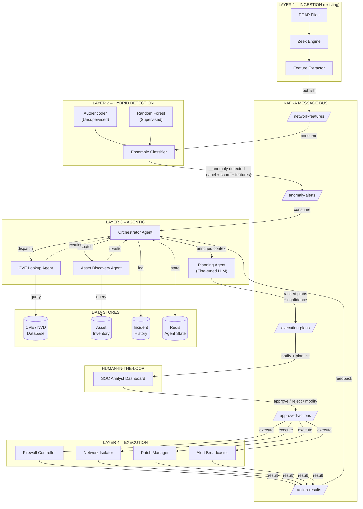
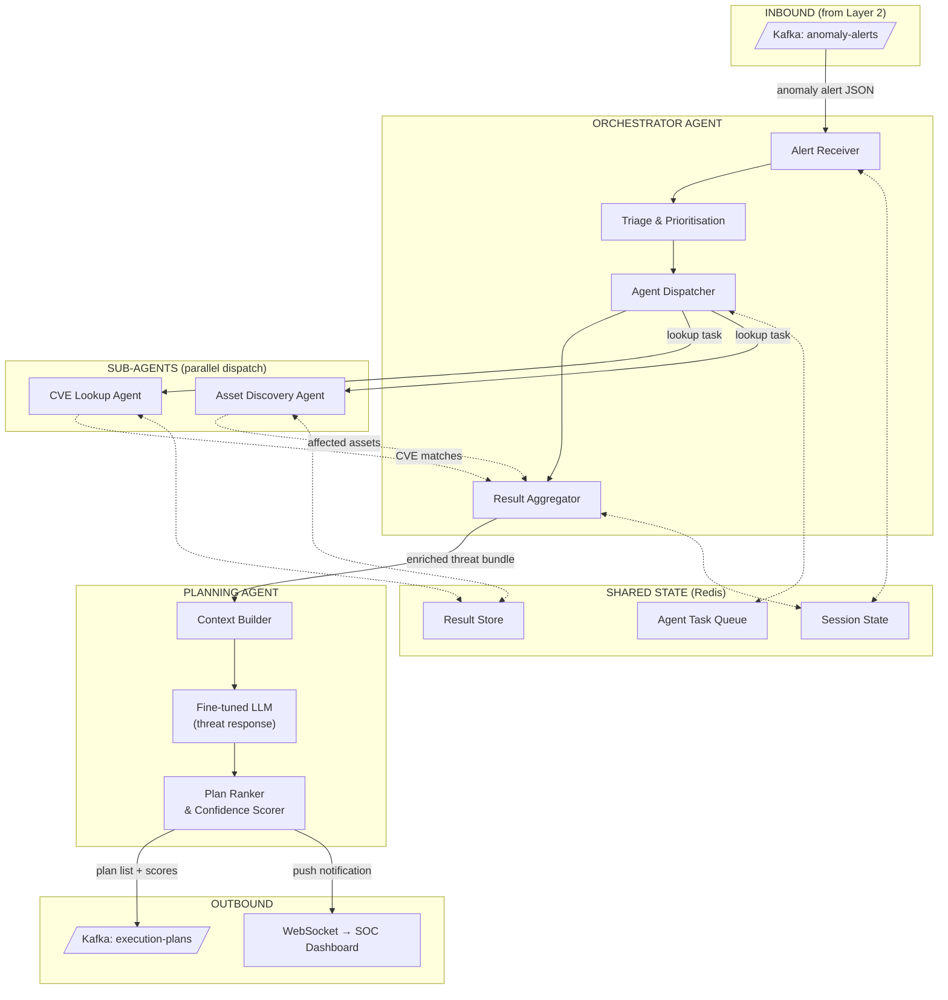
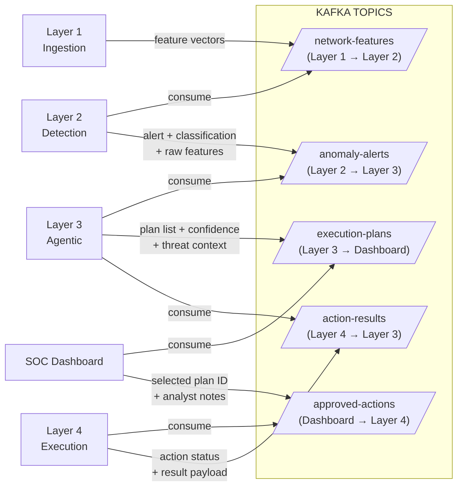
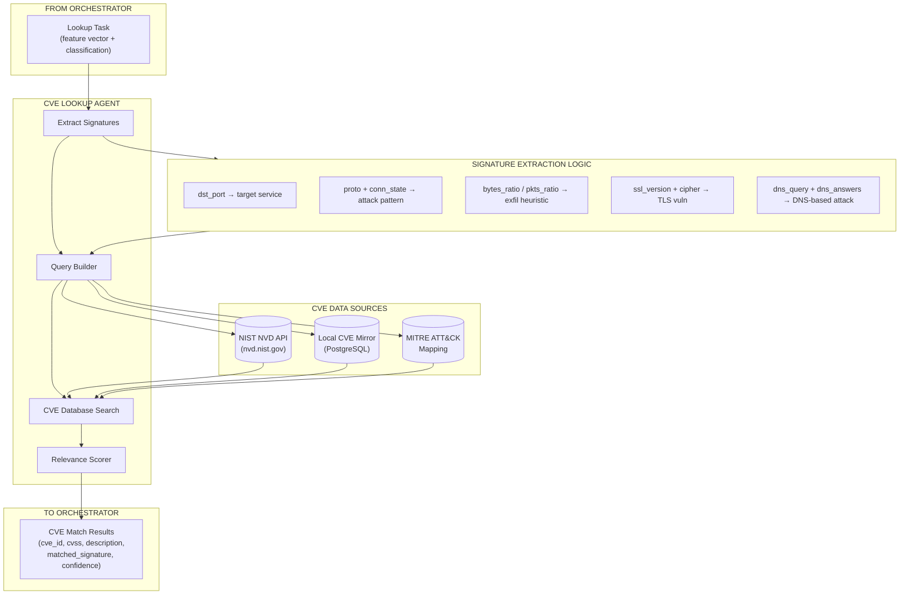
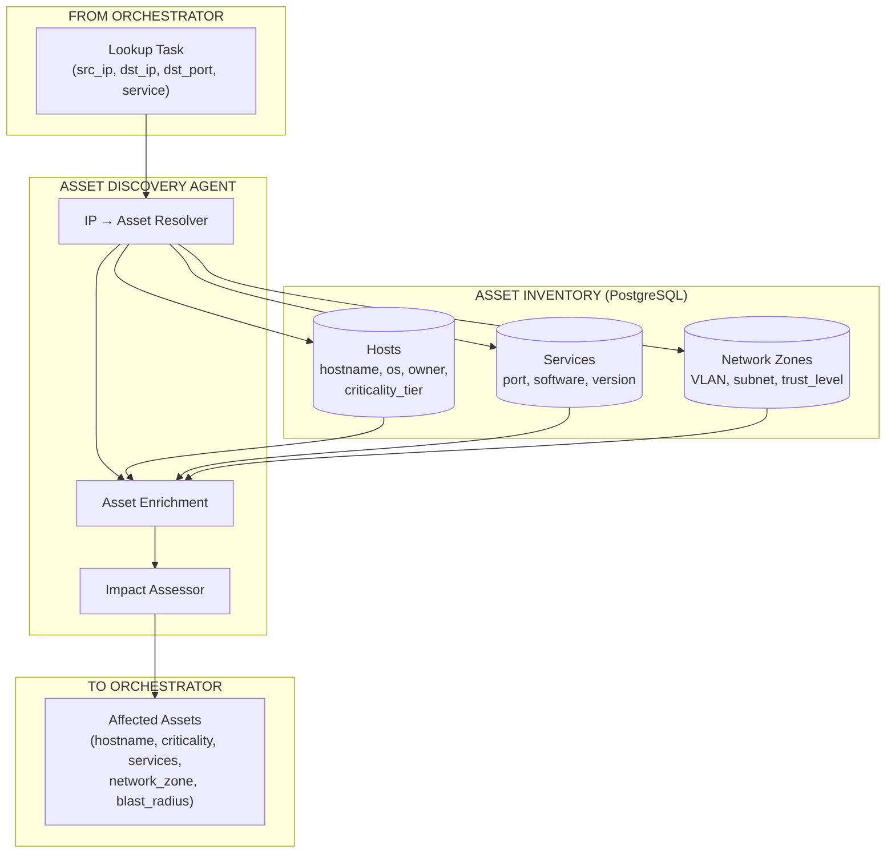
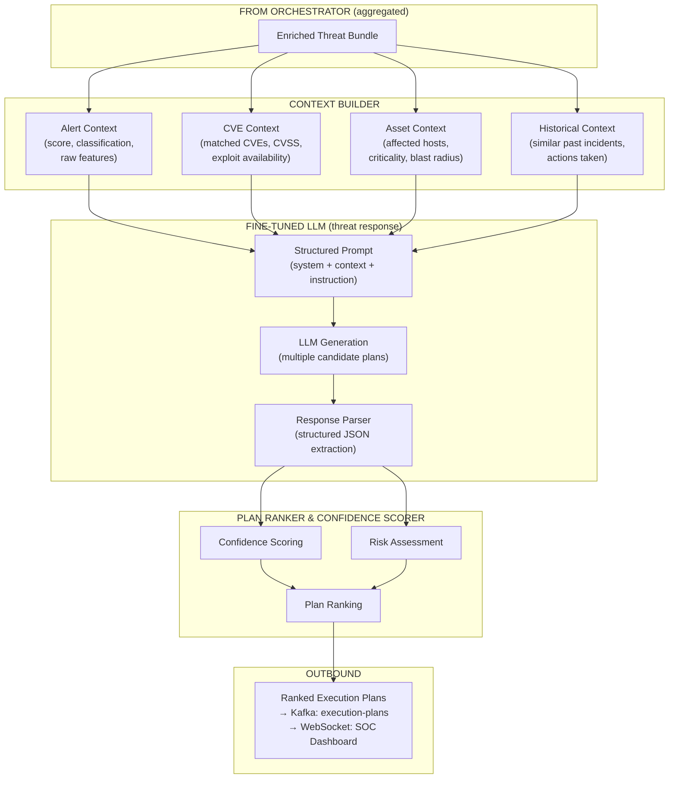
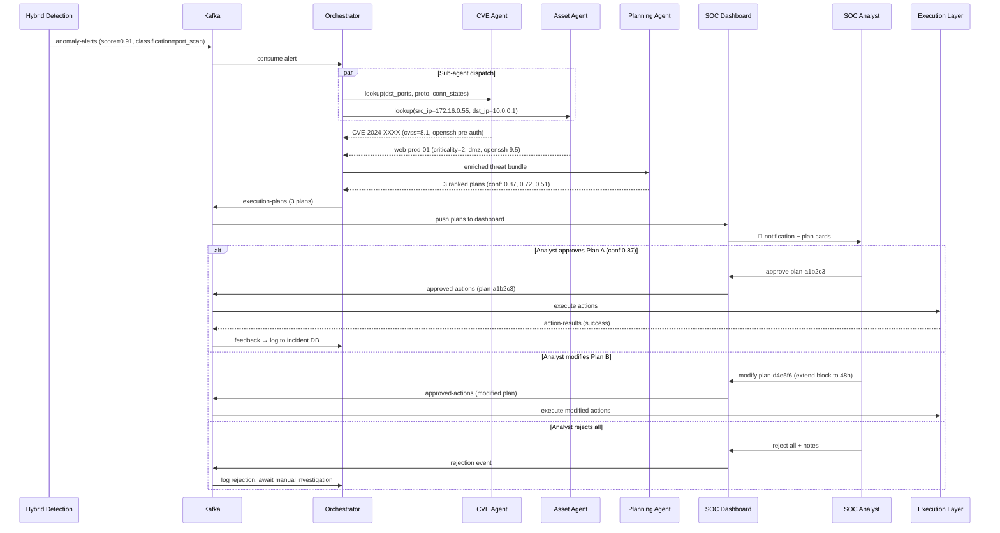
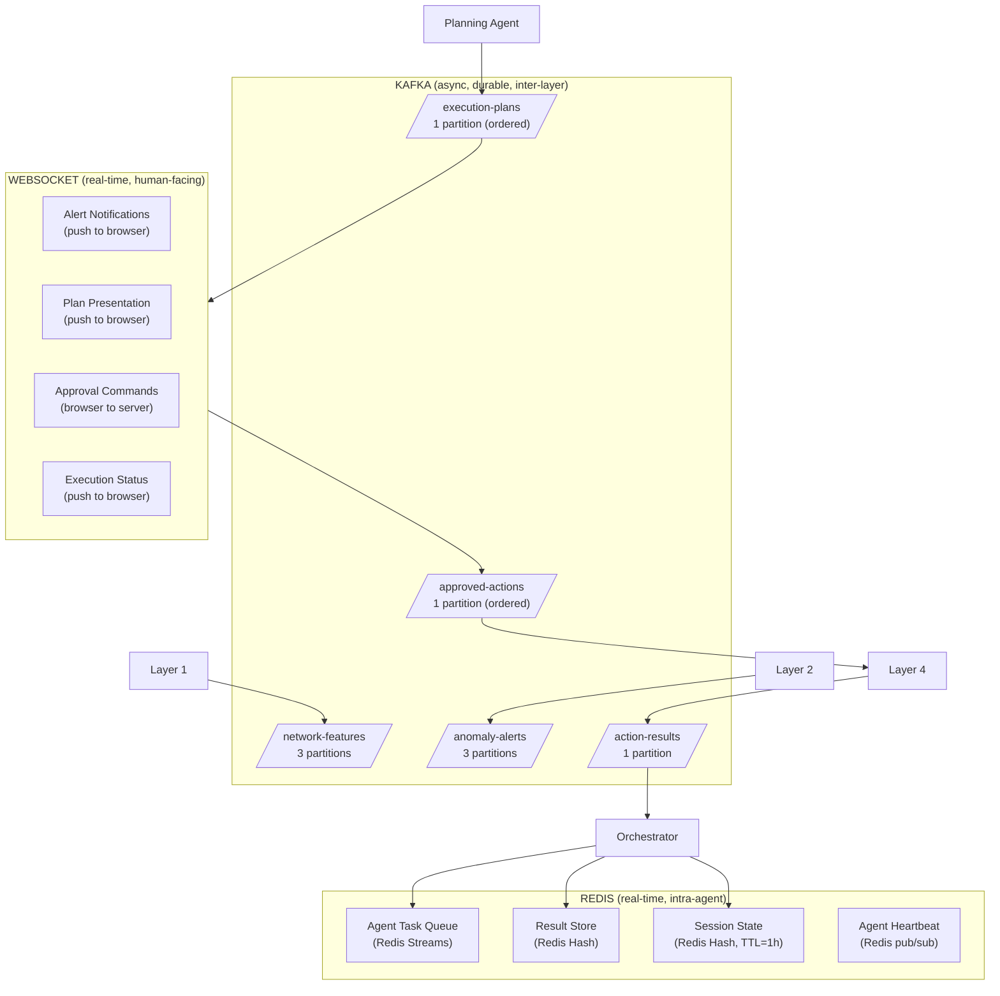
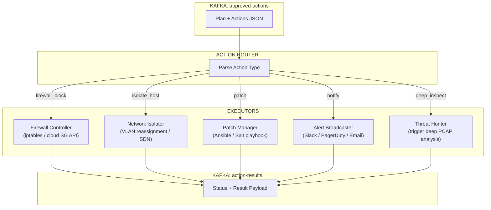
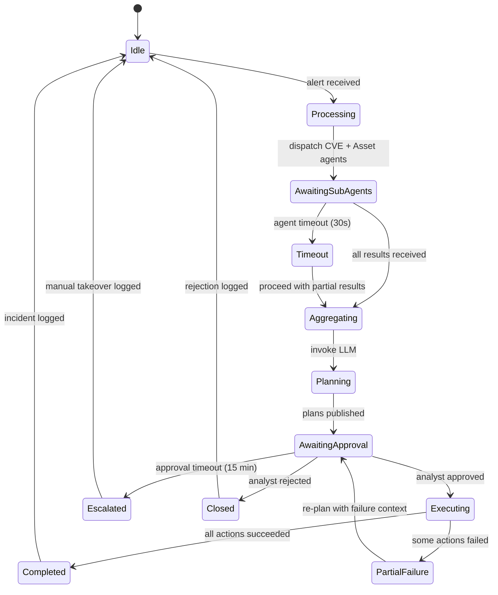

# Sentinel – Agentic Layer Architecture (Layer 3)

> Multi-agent orchestration for automated threat analysis, CVE correlation, and human-in-the-loop response planning.

---

## 1. System-Wide Architecture (All Layers)

Shows how the agentic layer (Layer 3) fits between the hybrid detection layer (Layer 2) and the execution layer (Layer 4), with Kafka as the backbone messaging system.



---

## 2. Agentic Layer – Internal Architecture

Zooms into the orchestrator and its sub-agents, showing the internal message flow, state management, and how the fine-tuned LLM is invoked.



---

## 3. Kafka Topic Schema & Message Flow

Defines every Kafka topic the agentic layer touches, including message direction and payload purpose.



### Topic Payload Summaries

| Topic | Producer | Consumer | Key Fields |
|---|---|---|---|
| `network-features` | Feature Extractor | Hybrid Detection | `uid`, `src_ip`, `dst_ip`, `proto`, `duration`, `bytes_ratio`, `conn_state_*`, `ssl_*`, `dns_*` |
| `anomaly-alerts` | Hybrid Detection | Orchestrator Agent | `alert_id`, `timestamp`, `anomaly_score`, `classification`, `feature_vector`, `model_votes` |
| `execution-plans` | Planning Agent | SOC Dashboard | `alert_id`, `threat_summary`, `cve_matches[]`, `affected_assets[]`, `plans[]` (each with `plan_id`, `actions[]`, `confidence`, `risk_level`) |
| `approved-actions` | SOC Dashboard | Execution Layer | `plan_id`, `alert_id`, `approved_by`, `actions[]`, `modifications`, `approval_timestamp` |
| `action-results` | Execution Layer | Orchestrator Agent | `plan_id`, `action_id`, `status`, `result_payload`, `error`, `completed_at` |

---

## 4. CVE Lookup Agent – Detail

Shows how the CVE Lookup Agent maps traffic characteristics to known exploits.



### Signature-to-CVE Mapping Logic

| Traffic Pattern | Extracted Signature | CVE Search Strategy |
|---|---|---|
| Port scan (many `conn_state_S0` to sequential ports) | `attack_type: port_scan`, target port range | Match CVEs for services on targeted ports |
| High `bytes_ratio` outbound, long duration | `attack_type: data_exfiltration`, volume estimate | Match C2/exfil CVEs for the destination service |
| Deprecated `ssl_version` (SSLv3, TLSv1.0) | `vuln_type: weak_tls`, specific version string | Direct CVE lookup (e.g., CVE-2014-3566 POODLE) |
| Unusual `dns_query` patterns (DGA-like) | `attack_type: dns_tunneling`, query entropy | Match DNS tunneling / DGA CVEs |
| Anomalous `resp_bytes` with `conn_state_RSTO` | `attack_type: exploit_attempt`, service + port | Match RCE/DoS CVEs for the target service |

---

## 5. Asset Discovery Agent – Detail



### Asset Enrichment Fields

| Field | Source | Purpose |
|---|---|---|
| `hostname` | IP → Host reverse lookup | Human-readable identification |
| `os` / `os_version` | Asset inventory | Determines CVE applicability |
| `owner` / `department` | Asset inventory | Notification routing |
| `criticality_tier` | Asset inventory (1-5) | Prioritises response urgency |
| `running_services` | Service catalog | Matches CVE to specific software versions |
| `network_zone` | Network topology DB | Calculates blast radius and lateral movement risk |
| `last_vuln_scan` | Vuln scanner integration | Determines if asset is already known-vulnerable |

---

## 6. Planning Agent & LLM Interaction



### Confidence Thresholds & Automation Tiers

| Confidence | Risk Level | Automation Tier | Human Action Required |
|---|---|---|---|
| ≥ 0.95 | Low | **Auto-execute** | Notification only (post-action) |
| 0.80 – 0.94 | Low–Medium | **Auto-recommend** | One-click approval with 15-min timeout |
| 0.60 – 0.79 | Medium | **Suggest** | Analyst must review and explicitly approve |
| 0.40 – 0.59 | Medium–High | **Advise** | Analyst review + supervisor sign-off |
| < 0.40 | High | **Escalate** | Full manual investigation required |

### Execution Plan Structure (per plan)

```json
{
  "plan_id": "plan-a1b2c3",
  "alert_id": "alert-x9y8z7",
  "confidence": 0.87,
  "risk_level": "medium",
  "automation_tier": "auto-recommend",
  "threat_summary": "Port scan from 172.16.0.55 targeting 25 ports on 10.0.0.1, matching CVE-2024-XXXX (OpenSSH pre-auth)",
  "actions": [
    {
      "action_id": "act-001",
      "type": "firewall_block",
      "target": "172.16.0.55",
      "params": {"direction": "inbound", "duration_hours": 24},
      "rationale": "Block scanning source IP at perimeter"
    },
    {
      "action_id": "act-002",
      "type": "patch",
      "target": "10.0.0.1",
      "params": {"cve": "CVE-2024-XXXX", "service": "openssh", "version": "9.6p1"},
      "rationale": "Upgrade OpenSSH to patched version"
    },
    {
      "action_id": "act-003",
      "type": "notify",
      "target": "soc-team",
      "params": {"channel": "slack", "severity": "high"},
      "rationale": "Alert SOC team of active reconnaissance"
    }
  ],
  "alternative_plans": ["plan-d4e5f6"],
  "cve_matches": [
    {"cve_id": "CVE-2024-XXXX", "cvss": 8.1, "confidence": 0.82}
  ],
  "affected_assets": [
    {"hostname": "web-prod-01", "criticality": 2, "network_zone": "dmz"}
  ]
}
```

---

## 7. Human-in-the-Loop – Approval Flow



---

## 8. Messaging Infrastructure



### Why Three Messaging Systems?

| System | Role | Justification |
|---|---|---|
| **Kafka** | Inter-layer, durable, async | Persistent log of all alerts, plans, and actions for audit. Handles backpressure. Decouples layers so any can restart without data loss. Partitioned for throughput on high-volume topics. |
| **Redis Streams/Pub-Sub** | Intra-agent coordination | Sub-agents need low-latency task dispatch and result collection within the agentic layer. Redis Streams provide consumer-group semantics for the task queue. Heartbeats via pub/sub detect agent failures in < 2s. Session state with TTL prevents stale context accumulation. |
| **WebSocket** | Human-facing real-time UI | SOC analysts need instant push notifications and interactive plan approval. HTTP polling would add unacceptable latency for time-critical security response. Bidirectional channel supports approval commands back from the browser. |

---

## 9. Execution Layer Interface



---

## 10. Failure Handling & Agent Lifecycle



---

## 11. Technology Stack Summary

| Component | Technology | Rationale |
|---|---|---|
| **Orchestrator / Agents** | Python 3.12 + `asyncio` | Consistent with existing codebase, async-native for concurrent sub-agents |
| **Agent Framework** | LangGraph or custom state machine | Structured agent orchestration with explicit state transitions |
| **LLM (Planning)** | Fine-tuned Llama 3 / Mistral (via vLLM or Ollama) | Local deployment, no data leaves the network, tuned on incident response playbooks |
| **Inter-layer messaging** | Apache Kafka (existing) | Already in stack, durable, auditable |
| **Intra-agent messaging** | Redis 7 Streams + pub/sub | Low-latency task dispatch, heartbeats, session state |
| **CVE Database** | PostgreSQL + NVD mirror (synced nightly) | Offline-capable, fast full-text search on CVE descriptions |
| **Asset Inventory** | PostgreSQL | Existing CMDB or custom schema for hosts, services, network zones |
| **Incident History** | PostgreSQL | Queryable log for historical context used by planning agent |
| **SOC Dashboard** | Extend existing FastAPI + WebSocket | Reuse Layer 1 dashboard, add approval UI |
| **Execution Layer** | Python + Ansible/Salt + REST APIs | Firewall rules, host isolation, patching, alerting via existing infra tooling |
| **Containerisation** | Docker Compose (dev) / Kubernetes (prod) | Consistent with existing deployment model |

---

## 12. Directory Structure (Proposed)

```
Sentinel/
├── capture/                          ← existing
├── ingestion/                        ← existing (Layer 1)
├── hybrid-detection/                 ← Layer 2 (to be built)
│   ├── models/
│   │   ├── autoencoder.py
│   │   └── random_forest.py
│   ├── ensemble.py
│   ├── consumer.py                   ← Kafka consumer for network-features
│   └── producer.py                   ← Kafka producer for anomaly-alerts
├── agentic/                          ← Layer 3 (this design)
│   ├── orchestrator/
│   │   ├── agent.py                  ← main orchestrator loop
│   │   ├── triage.py                 ← alert triage & prioritisation
│   │   └── dispatcher.py             ← sub-agent task dispatch
│   ├── agents/
│   │   ├── cve_lookup.py             ← CVE/NVD query agent
│   │   ├── asset_discovery.py        ← asset inventory query agent
│   │   └── base.py                   ← shared agent interface
│   ├── planning/
│   │   ├── context_builder.py        ← assembles LLM prompt context
│   │   ├── llm_client.py             ← fine-tuned LLM interface
│   │   ├── plan_ranker.py            ← confidence scoring & ranking
│   │   └── prompts/
│   │       └── threat_response.jinja ← structured prompt template
│   ├── state/
│   │   ├── redis_client.py           ← Redis connection + helpers
│   │   └── session.py                ← per-incident session state
│   ├── kafka/
│   │   ├── consumer.py               ← anomaly-alerts consumer
│   │   └── producer.py               ← execution-plans producer
│   ├── models/                       ← Pydantic schemas
│   │   ├── alert.py
│   │   ├── plan.py
│   │   └── asset.py
│   ├── Dockerfile
│   └── requirements.txt
├── execution/                        ← Layer 4
│   ├── router.py                     ← action type → executor mapping
│   ├── executors/
│   │   ├── firewall.py
│   │   ├── isolator.py
│   │   ├── patcher.py
│   │   └── notifier.py
│   ├── kafka/
│   │   ├── consumer.py               ← approved-actions consumer
│   │   └── producer.py               ← action-results producer
│   ├── Dockerfile
│   └── requirements.txt
├── dashboard/                        ← existing (extended for approval UI)
├── docs/architecture/
│   └── AGENTIC_LAYER.md              ← this document
└── docker-compose.yml                ← extended with new services
```
